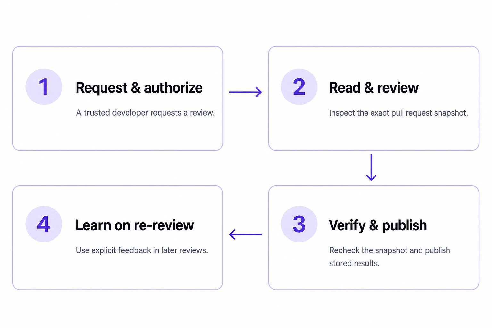

# Review Agent

Self-hosted, advisory AI code review for GitHub pull requests, built on Hermes
and Codex with deterministic controls.

[](https://github.com/CCimen/review-agent/actions/workflows/ci.yml)
[](https://github.com/CCimen/review-agent/actions/workflows/docs-pages.yml)
[](https://ccimen.github.io/review-agent/)

A trusted developer comments `/review` on a pull request. The service pins the
exact base/head snapshot, reviews it in two passes through bounded read tools,
and posts evidence-backed findings through a deterministic publisher. Reviews
stay advisory: the reviewer has no shell, no repository write access, and no
merge authority.



## Quick start

1. **Deploy the service** with Compose, Dokploy, Coolify, Portainer, or
   OpenShift: [deployment guide](docs/DEPLOYMENT.md).
2. **Onboard a repository**: allowlist it, install the trusted workflow, and
   set its secrets: [getting started](docs/GETTING_STARTED.md).
3. **Request a review** with a new top-level PR comment:

   ```text
   /review
   ```

After fixing findings, push a commit and comment `/review` again; the new
snapshot starts a fresh round. Structured feedback from allowlisted developers
goes in a new top-level comment:

```text
/review false-positive F2 because <what code, guard, or invariant disproves it>
/review feedback scope F2 because <why this finding is outside the intended PR scope>
/review feedback missed because <what concrete issue was missed and where>
```

A [sanitized example review](examples/comments/example-review.md) shows the
comment shape a pull request receives.

## Documentation

The [documentation site](https://ccimen.github.io/review-agent/) has local
search and task-based navigation. Key pages:

| You want to | Read |
| --- | --- |
| Run your first review | [Getting started](docs/GETTING_STARTED.md) |
| Deploy the service | [Deployment](docs/DEPLOYMENT.md) |
| Understand the lifecycle | [How reviews work](docs/HOW_REVIEWS_WORK.md) |
| Change voice or review rules | [Behavior ownership](docs/BEHAVIOR_OWNERSHIP.md) |
| Operate or recover it | [Operations](docs/OPERATIONS.md) |
| Assess trust boundaries | [Security](docs/SECURITY.md) |
| See capabilities and boundaries | [Capabilities](docs/ROADMAP.md) |

## What it does

- Reviews the exact base/head snapshot of an open PR through bounded plugin
  tools: metadata, diffs, changed-file lists, and selected files.
- Publishes every evidence-backed finding that survives a skeptical second
  pass, and reports incomplete coverage instead of implying a clean review.
- Re-checks unresolved findings from earlier rounds on each new review.
- Offers small, independently safe patches through GitHub's native suggestion
  UI; coordinated changes go into a copyable coding-agent brief.
- Stores runs, findings, coverage, publication state, and human feedback in
  PostgreSQL, then freezes exact comment parts for a separate publisher with a
  recoverable lease. Interrupted delivery resumes from durable state.

## What it does not do

- Gate merges. Reviews stay advisory unless your organization makes a separate
  merge-policy decision.
- Replace CodeQL, Dependabot, dependency review, or CVE scanning. Those stay
  independent CI controls; [docs/SECURITY.md](docs/SECURITY.md) owns the
  dependency-scanning boundary.
- Execute contributor code, or give the model a shell, browser, delegation, or
  arbitrary GitHub write access.

## Configuration

The reusable part is the review engine: webhook admission, bounded GitHub
reads, PostgreSQL review state, deterministic publication, and operator
tooling. Voice and review policy live in a swappable profile; select one with
`REVIEW_AGENT_PROFILE=<profile-key>`. The shipped `sundsvall-standard` bundle
is the default deployment profile, not the product identity.

[Behavior ownership](docs/BEHAVIOR_OWNERSHIP.md) maps every concern to its
owner and explains how to create a profile. Authorization, snapshot checks,
persistence, and publication rules are engine configuration; a profile cannot
change them.

## Operations and security

[docs/OPERATIONS.md](docs/OPERATIONS.md) owns runtime limits, recovery,
backups, updates, and operator commands. [docs/SECURITY.md](docs/SECURITY.md)
owns the trust model, prompt-injection posture, token boundaries, and
dependency-scanning scope.

The short version: the reviewer is useful because it has narrow tools and
durable audit state. Keep deterministic scanners, tests, type checks, and
human ownership as separate controls.

## Development

Run the full validation bundle before shipping changes:

```bash
./scripts/check_bundle.sh
```

GitHub Actions runs the same bundle for pull requests and pushes to `main`,
builds the container, and verifies the pinned Hermes contracts used by durable
execution. It cannot live-test your deployed routes, GitHub token approval,
ChatGPT OAuth state, or repository rules.
