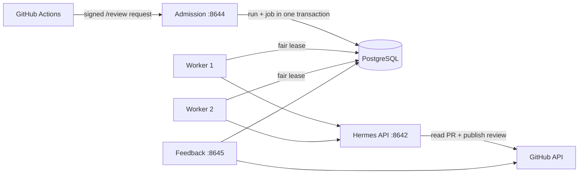

import Tabs from '@theme/Tabs';
import TabItem from '@theme/TabItem';

# Deploy Review Agent

> **TL;DR**: Build one image, provide PostgreSQL and three scoped GitHub tokens,
> then expose only the admission endpoint. Add worker replicas to process more
> repositories at once. Queue limits protect shared compute and do not limit PR
> size.

## Runtime shape



Expose admission on port `8644`. Expose feedback on `8645` only when you enable
feedback. Keep Hermes `8642` and PostgreSQL off the shared proxy network; the
dedicated egress network lets Hermes reach GitHub and its model provider.

## Create the credentials

### GitHub tokens

Create three fine-grained personal access tokens. GitHub Apps are a better fit
when many organizations install the service, but repository-scoped tokens keep a
single-organization deployment small.

For each token:

1. Open **GitHub > Settings > Developer settings > Personal access tokens >
   Fine-grained tokens** and select **Generate new token**.
2. Select the organization as **Resource owner**, set an expiration, and choose
   **Only select repositories**.
3. Select the repositories that Review Agent may access.
4. Grant the permissions from the table, generate the token, and store it in the
   deployment secret manager.
5. If GitHub marks the token `pending`, ask an organization owner to approve it.

| Deployment value | Repository permissions |
| --- | --- |
| `GITHUB_READ_TOKEN` | Contents read, Pull requests read, Metadata read |
| `REVIEW_AGENT_PUBLISH_GH_TOKEN` | Pull requests read/write, Metadata read |
| `REVIEW_AGENT_FEEDBACK_GH_TOKEN` | Issues read/write, Pull requests read, Metadata read |

GitHub documents the [token creation flow](https://docs.github.com/en/authentication/keeping-your-account-and-data-secure/managing-your-personal-access-tokens)
and lists [permissions for each REST endpoint](https://docs.github.com/en/rest/authentication/permissions-required-for-fine-grained-personal-access-tokens).
The publisher does not need Contents write, Actions, Administration, or Secrets.

### Service secrets

Generate different random values for admission, feedback, and the private Hermes
API:

```bash
openssl rand -hex 32  # REVIEW_AGENT_WEBHOOK_SECRET
openssl rand -hex 32  # REVIEW_AGENT_FEEDBACK_WEBHOOK_SECRET
openssl rand -hex 32  # API_SERVER_KEY
```

Use a fourth random value for the PostgreSQL password. Do not reuse a webhook
secret as a GitHub token or database password.

## Deploy

<Tabs groupId="deployment-platform">
<TabItem value="compose" label="Compose / Dokploy" default>

1. Copy `.env.example` to the platform secret store and replace each placeholder.
2. Create the external ingress network. Dokploy already provides
   `dokploy-network`; a plain Docker host can create its configured name:

   ```bash
   docker network create "${REVIEW_AGENT_INGRESS_NETWORK:-dokploy-network}"
   ```

3. Validate and start the stack:

   ```bash
   docker compose config --quiet
   docker compose up -d --build
   docker compose ps
   ```

4. Route the review hostname to `review-admission:8644`. Route the optional
   feedback hostname to `hermes-review-feedback:8645`. Do not route
   `hermes-review`, `review-worker`, or `review-postgres`.
5. Connect the Codex account and restart Hermes:

   ```bash
   docker compose exec hermes-review hermes auth add openai-codex
   docker compose restart hermes-review
   curl -fsS https://review.example.org/ready
   ```

Dokploy reads `compose.yaml` as a Compose application. Add the two HTTPS domains
to the services above and keep the generated Traefik settings. The checked-in
health checks cover admission, feedback, Hermes, and PostgreSQL.

</TabItem>
<TabItem value="coolify-portainer" label="Coolify / Portainer">

Import `compose.yaml` as a Compose stack and enter the values from `.env.example`
in the platform secret UI. Set `REVIEW_AGENT_INGRESS_NETWORK` to the external
proxy network used by the platform. Point the public proxy at
`review-admission:8644` and, when enabled, `hermes-review-feedback:8645`.

Both platforms run the same containers and health checks. Platform-specific
work stays at the proxy boundary; do not publish Hermes or PostgreSQL ports to
the host.

</TabItem>
<TabItem value="openshift" label="OpenShift">

The OpenShift template uses an external PostgreSQL service and an immutable
image built from this repository. Push the image to a registry that the project
can pull, then create the project and role-specific secrets:

```bash
oc new-project review-agent

oc create secret generic review-agent-database \
  --from-literal=REVIEW_AGENT_DATABASE_URL="$REVIEW_AGENT_DATABASE_URL"
oc create secret generic review-agent-admission \
  --from-literal=REVIEW_AGENT_WEBHOOK_SECRET="$REVIEW_AGENT_WEBHOOK_SECRET" \
  --from-literal=GITHUB_READ_TOKEN="$GITHUB_READ_TOKEN"
oc create secret generic review-agent-hermes \
  --from-literal=GITHUB_READ_TOKEN="$GITHUB_READ_TOKEN" \
  --from-literal=REVIEW_AGENT_PUBLISH_GH_TOKEN="$REVIEW_AGENT_PUBLISH_GH_TOKEN" \
  --from-literal=API_SERVER_KEY="$API_SERVER_KEY"
oc create secret generic review-agent-worker \
  --from-literal=API_SERVER_KEY="$API_SERVER_KEY"
oc create secret generic review-agent-feedback \
  --from-literal=REVIEW_AGENT_FEEDBACK_WEBHOOK_SECRET="$REVIEW_AGENT_FEEDBACK_WEBHOOK_SECRET" \
  --from-literal=REVIEW_AGENT_FEEDBACK_GH_TOKEN="$REVIEW_AGENT_FEEDBACK_GH_TOKEN" \
  --from-literal=REVIEW_AGENT_FEEDBACK_ALLOWED_ACTOR_IDS="$REVIEW_AGENT_FEEDBACK_ALLOWED_ACTOR_IDS"
```

Process the template with the immutable image tag or digest:

```bash
oc process -f examples/openshift/review-agent-template.yaml \
  -p IMAGE="$REVIEW_AGENT_IMAGE" \
  -p PROFILE=sundsvall-standard \
  -p ALLOWED_REPOSITORIES='org/repository' | oc apply -f -

oc wait --for=condition=complete job/review-agent-profile-install --timeout=5m
oc wait --for=condition=complete job/review-agent-db-migrate --timeout=5m
```

Start Hermes first, complete the device login, then start admission and workers:

```bash
oc scale deployment/hermes-review --replicas=1
oc wait --for=condition=available deployment/hermes-review --timeout=5m
oc rsh deployment/hermes-review hermes auth add openai-codex
oc rollout restart deployment/hermes-review
oc rollout status deployment/hermes-review --timeout=5m

oc scale deployment/review-agent-admission --replicas=1
oc scale deployment/review-agent-worker --replicas=1
oc get route review-agent
```

Enable feedback after setting `REVIEW_AGENT_FEEDBACK_ENABLED=true` in the ConfigMap:

```bash
oc patch configmap review-agent-config --type merge \
  -p '{"data":{"REVIEW_AGENT_FEEDBACK_ENABLED":"true"}}'
oc scale deployment/review-agent-feedback --replicas=1
oc get route review-agent-feedback
```

The template omits `runAsUser`, drops Linux capabilities, and uses the direct
Hermes command instead of the image's root-oriented init process. OpenShift can
assign a UID from the namespace range under `restricted-v2`. Writable state is
limited to the PVC, `/opt/data`, and `emptyDir` mounts. Hermes uses a `Recreate`
deployment strategy because its PVC is `ReadWriteOnce`; the worker-only network
policy protects the private API. Red Hat documents the
[arbitrary UID image contract](https://docs.redhat.com/en/documentation/openshift_container_platform/4.11/html/images/creating-images#images-create-guide-openshift_create-images)
and the [restricted-v2 SCC](https://docs.redhat.com/en/documentation/openshift_container_platform/4.15/html/authentication_and_authorization/managing-pod-security-policies).

</TabItem>
</Tabs>

## Configure GitHub Actions

Copy `examples/github/ai-review-request.yml` to
`.github/workflows/ai-review-request.yml` on the repository's default branch.
The workflow grants its short-lived `GITHUB_TOKEN` `issues: write` and
`pull-requests: write` so it can add the receipt reaction. It does not receive
the deployment PATs.

Open **Repository Settings > Secrets and variables > Actions**. Create four
repository secrets:

| Secret | Value |
| --- | --- |
| `HERMES_REVIEW_URL` | `https://review.example.org/webhooks/review-agent` |
| `HERMES_WEBHOOK_SECRET` | Same value as `REVIEW_AGENT_WEBHOOK_SECRET` |
| `HERMES_REVIEW_FEEDBACK_URL` | `https://review-feedback.example.org/webhooks/review-agent-feedback` |
| `HERMES_REVIEW_FEEDBACK_SECRET` | Same value as `REVIEW_AGENT_FEEDBACK_WEBHOOK_SECRET` |

On the **Variables** tab, create `AI_REVIEW_ALLOWED_USERS` with a comma-separated
list of trusted GitHub usernames. Empty means deny all. GitHub documents the UI
for [repository secrets](https://docs.github.com/en/actions/how-tos/write-workflows/choose-what-workflows-do/use-secrets#creating-secrets-for-a-repository)
and [repository variables](https://docs.github.com/en/actions/how-tos/write-workflows/choose-what-workflows-do/use-variables#creating-configuration-variables-for-a-repository).

Protect the workflow with CODEOWNERS or a ruleset. A maintainer who passes both
the username allowlist and GitHub's `OWNER`, `MEMBER`, or `COLLABORATOR`
association check can now comment `/review`.

## Scale and operate the queue

Each worker runs one model review at a time. PostgreSQL prevents two live leases
for the same repository, while priority aging lets older ready jobs advance.
Scale workers to increase cross-repository throughput:

```bash
docker compose up -d --scale review-worker=3
# or
oc scale deployment/review-agent-worker --replicas=3
```

Inspect active jobs, release a delayed retry, or cancel the owning run:

```bash
review-agent-database jobs --limit 100
review-agent-database retry-job --job-id 42
review-agent-database cancel-job --job-id 42
```

Tune `REVIEW_AGENT_ACTIVE_JOB_LIMIT` from observed wait time and model capacity.
`REVIEW_AGENT_JOB_PRIORITY_AGING_SECONDS` controls how long one priority point
can move a ready job forward. Neither value limits files, lines, tokens, or total
review depth. Keep the active-job limit near measured capacity: each idle worker
checks the bounded ready queue at its configured poll interval.
