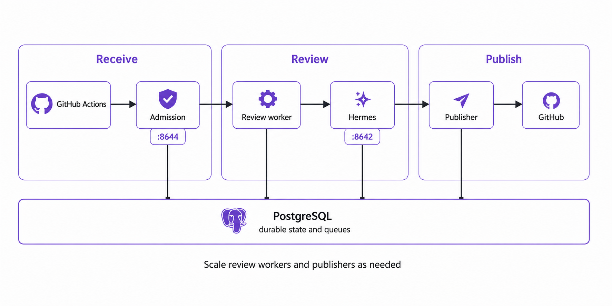

import Tabs from '@theme/Tabs';
import TabItem from '@theme/TabItem';

# Deploy Review Agent

> **TL;DR**: Choose a released image or build locally, provide PostgreSQL and a
> repository-scoped GitHub App, then expose only the admission endpoint. Tune
> bounded worker concurrency before adding replicas. Queue limits protect shared
> compute and do not limit PR size.

## Runtime shape



One box represents one worker type, not one replica. Scale review workers and
publishers independently. Expose admission on port `8644`. Keep the GitHub
gateway, Hermes `8642`, and PostgreSQL off the shared proxy network.

The GitHub App receives review commands directly. The private gateway uses its
key for bounded source and publication operations; Hermes and the publisher do
not receive the key or installation tokens.

## Create the credentials

### GitHub App

Create a GitHub App with webhook events and permissions from [GitHub App
setup](./GITHUB_APP_PILOT.md). Install it with **Only select repositories**.
Store the App ID, webhook secret, and private-key file in the deployment secret
manager. The App needs Contents read, Issues write, Pull requests write, and
Metadata read; it does not need Actions, Administration, Secrets, or Contents
write.

### Service secrets

Generate different random values for the App webhook and the private Hermes API:

```bash
openssl rand -hex 32  # REVIEW_AGENT_GITHUB_APP_WEBHOOK_SECRET
openssl rand -hex 32  # API_SERVER_KEY
```

Use another random value for the PostgreSQL password. Do not reuse a webhook
secret as a GitHub token or database password.

## Choose an image

For local development, keep `REVIEW_AGENT_IMAGE=review-agent:local` and start
Compose with `--build`. Each published release also creates one attested
`linux/amd64` and `linux/arm64` image in GitHub Container Registry. Use the exact
release tag in deployments:

```bash
export REVIEW_AGENT_IMAGE=ghcr.io/ccimen/review-agent:vX.Y.Z
docker compose pull
docker compose up -d --no-build
```

`--no-build` prevents a missing pull from being replaced by a locally tagged
working-tree build.

Prereleases receive only their exact version tag. Stable releases also update
`latest`; production deployments should still pin the exact version. GitHub
creates the first package as private even for a public repository. After the
first release, open **Packages > review-agent > Package settings > Change
visibility** to make anonymous pulls available. Public visibility cannot be
reversed. See GitHub's guides to
[publishing container images](https://docs.github.com/en/actions/tutorials/publish-packages/publish-docker-images)
and [package visibility](https://docs.github.com/en/packages/learn-github-packages/configuring-a-packages-access-control-and-visibility).

## Deploy

<Tabs groupId="deployment-platform">
<TabItem value="compose" label="Compose / Dokploy" default>

1. Copy `.env.example` to the platform secret store and replace each
   `replace-with...` placeholder: the GitHub App values, service secrets, and
   PostgreSQL password and URL.
   Every other value is a documented tuning default you can keep.

   On Dokploy, add the App PEM as a **File Mount** with file path
   `github-app-private-key.pem`. Dokploy keeps Compose file mounts beside the
   replaceable Git checkout, so set:

   ```dotenv
   REVIEW_AGENT_GITHUB_APP_PRIVATE_KEY_PATH=../files/github-app-private-key.pem
   ```

   Do not paste the PEM into the environment. Compose reads that host-side file
   and mounts it read-only into the private GitHub gateway. If the file is
   absent or unreadable, `review-github-gateway` will not become healthy.
2. Create the external ingress network. Dokploy already provides
   `dokploy-network`; a plain Docker host can create its configured name:

   ```bash
   docker network create "${REVIEW_AGENT_INGRESS_NETWORK:-dokploy-network}"
   ```

3. Validate the stack, then choose one start path:

   ```bash
   docker compose config --quiet
   ```

   Local source:

   ```bash
   docker compose up -d --build
   ```

   Released image after `REVIEW_AGENT_IMAGE` is set:

   ```bash
   docker compose pull
   docker compose up -d --no-build
   ```

   Confirm the services started:

   ```bash
   docker compose ps
   ```

4. Route the review hostname to `review-admission:8644`.

   :::warning[Keep private services off the proxy]
   Do not route `hermes-review`, `review-worker`, `review-publisher`,
   `review-github-gateway`, or `review-postgres`. Only admission belongs on the
   ingress network.
   :::
5. Connect the Codex account and restart Hermes:

   ```bash
   docker compose exec hermes-review hermes auth add openai-codex
   docker compose restart hermes-review
   curl -fsS https://review.example.org/ready
   ```

Dokploy reads `compose.yaml` as a Compose application. Add one HTTPS domain to
admission and keep the generated Traefik settings. The checked-in health checks
cover admission, the private gateway, Hermes, and PostgreSQL.

</TabItem>
<TabItem value="coolify-portainer" label="Coolify / Portainer">

Import `compose.yaml` as a Compose stack and enter the values from `.env.example`
in the platform secret UI. Set `REVIEW_AGENT_INGRESS_NETWORK` to the external
proxy network used by the platform. Point the public proxy at
`review-admission:8644`.

Both platforms run the same containers and health checks. Platform-specific
work stays at the proxy boundary; do not publish Hermes or PostgreSQL ports to
the host.

</TabItem>
<TabItem value="openshift" label="OpenShift">

The template expects an existing PostgreSQL database and three secrets. Set the
webhook variable to the exact value registered in the GitHub App, then create
the secrets in the target project:

```bash
export REVIEW_AGENT_GITHUB_APP_WEBHOOK_SECRET='paste-the-registered-value'
oc create secret generic review-agent-database \
  --from-literal=REVIEW_AGENT_DATABASE_URL='postgresql://...'
oc create secret generic review-agent-hermes \
  --from-literal=API_SERVER_KEY="$(openssl rand -hex 32)"
oc create secret generic review-agent-github-app \
  --from-literal=REVIEW_AGENT_GITHUB_APP_ID='123456' \
  --from-literal=REVIEW_AGENT_GITHUB_APP_WEBHOOK_SECRET="$REVIEW_AGENT_GITHUB_APP_WEBHOOK_SECRET" \
  --from-file=github-app-private-key.pem=./github-app-private-key.pem
```

Render the template with one immutable image, wait for its initialization jobs,
then start the six long-running components:

```bash
oc delete job review-agent-profile-install review-agent-db-migrate \
  --ignore-not-found
oc process -f examples/openshift/review-agent-template.yaml \
  -p IMAGE=ghcr.io/ccimen/review-agent:vX.Y.Z \
  -p WORKER_CONCURRENCY=4 | oc apply -f -
oc wait --for=condition=complete job/review-agent-profile-install \
  job/review-agent-db-migrate --timeout=10m
oc scale deployment/hermes-review deployment/review-agent-admission \
  deployment/review-agent-github-gateway \
  deployment/review-agent-github-app-worker deployment/review-agent-worker \
  deployment/review-agent-publisher --replicas=1
oc get route review-agent
```

Delete only these completed initialization Jobs before an upgrade. Their pod
templates are immutable, and recreating them makes the profile and migration
checks run against the exact image being deployed.

Use `https://<route-host>/webhooks/github-app` as the App webhook URL. Connect
Codex inside Hermes once, then restart that deployment:

```bash
oc rsh deployment/hermes-review hermes auth add openai-codex
oc rollout restart deployment/hermes-review
oc rsh deployment/hermes-review review-agent-admin doctor
```

Only admission has a Route. The template mounts the App key into the private
gateway pod and allows gateway ingress only from Hermes, the App delivery
worker, and the publisher. It omits `runAsUser`, drops Linux capabilities, and
uses PVC or `emptyDir` mounts for writable paths so OpenShift can assign an
arbitrary UID under `restricted-v2`.

</TabItem>
</Tabs>

## Configure GitHub

Register the App, install it with **Only select repositories**, reconcile the
installation, and explicitly enable each repository. The [GitHub App setup
guide](./GITHUB_APP_PILOT.md) has the exact permissions and commands. No
repository workflow or Actions secrets are required.

## Scale and operate the queue

Each worker process runs up to `REVIEW_AGENT_WORKER_CONCURRENCY` model reviews at
once (`4` by default) and claims work only when a slot is free. PostgreSQL
prevents two live leases for the same repository, while priority aging lets
older ready jobs advance. Increase the per-process value while CPU, memory, and
provider capacity remain healthy; add replicas when you need more capacity or
failure isolation:

```bash
# 100 cross-repository slots, plus room for 20 queued reviews.
REVIEW_AGENT_ACTIVE_JOB_LIMIT=120 REVIEW_AGENT_WORKER_CONCURRENCY=10 \
  docker compose up -d --scale review-worker=10

oc set env deployment/review-agent-github-app-worker REVIEW_AGENT_ACTIVE_JOB_LIMIT=120
oc set env deployment/review-agent-worker REVIEW_AGENT_WORKER_CONCURRENCY=10
```

Set `REVIEW_AGENT_ACTIVE_JOB_LIMIT` at or above the number of active and queued
reviews you intend to accept. The bundled Compose database allows 200
connections; use the pool formula in Operations to size an external database.
Confirm that the model provider accepts the chosen concurrency. Compose limits
each worker container to 64 PIDs. Keep per-replica concurrency at or below 25
for thread headroom, or raise the PID limit after a capacity test. The shown
value of 10 stays within the shipped limit.

The OpenShift worker reads the managed profile from a `ReadWriteOnce` PVC.
Keep one worker replica unless the storage class provides `ReadWriteMany` or
the scheduler constrains all consumers to the volume's node. Increase
per-process concurrency first; add replicas only after satisfying that storage
contract.

Scale `review-publisher` the same way when publication wait time grows. The
database prevents two publishers from owning the same delivery generation.

Inspect active jobs, release a delayed retry, or cancel the owning run:

```bash
review-agent-admin queues inspect
review-agent-admin jobs list --limit 100
review-agent-admin jobs retry 42
review-agent-admin jobs cancel 42
```

Tune `REVIEW_AGENT_ACTIVE_JOB_LIMIT` from observed wait time and model capacity.
`REVIEW_AGENT_JOB_PRIORITY_AGING_SECONDS` controls how long one priority point
can move a ready job forward. Neither value limits files, lines, tokens, or total
review depth. Keep the active-job limit near measured capacity: each idle worker
checks the bounded ready queue at its configured poll interval.
