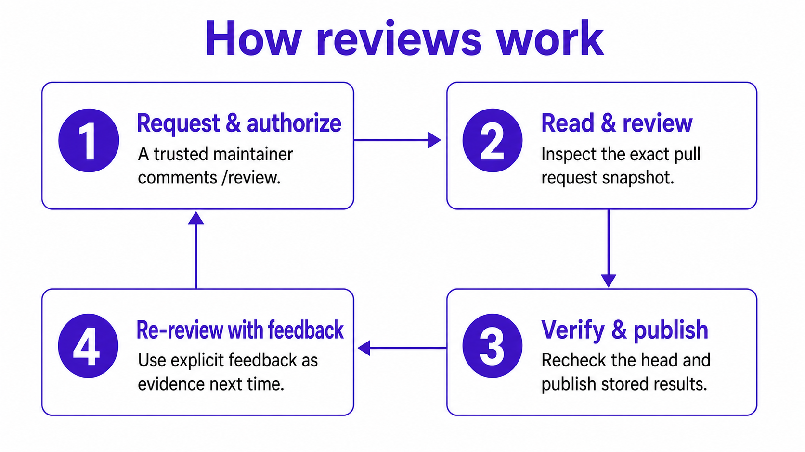

# Review Agent

> **Current** — This page describes the reviewer available in this repository
> today.

Review Agent is a self-hosted, advisory pull-request reviewer built on Hermes.
An authorized maintainer comments `/review` on a PR; the service pins the
exact base/head snapshot, reviews it through bounded read tools, and posts
evidence-backed findings through a deterministic publisher.

The reusable part is the review engine: webhook admission, bounded GitHub
reads, PostgreSQL review state, human feedback, deterministic publication, and
operator tooling. Voice and review policy live in a swappable profile, not in
the engine.

## Start here

| You want to | Read |
| --- | --- |
| Run your first review | [Getting started](./GETTING_STARTED.md) |
| Deploy the service | [Compose, Dokploy, Coolify, Portainer, or OpenShift](./DEPLOYMENT.md) |
| Understand the lifecycle | [How reviews work](./HOW_REVIEWS_WORK.md) |
| Change voice or review rules | [Behavior ownership](./BEHAVIOR_OWNERSHIP.md) |
| Operate or recover it | [Operations](./OPERATIONS.md) |
| Assess trust boundaries | [Security](./SECURITY.md) |

A [sanitized example review](../examples/comments/example-review.md) shows the
exact comment shape a pull request receives.

## What it does

- Reviews the exact base/head snapshot of an open GitHub PR through bounded
  plugin tools: PR metadata, diffs, changed-file lists, and selected files.
- Publishes every evidence-backed finding that survives the skeptical second
  pass. There is no editorial quota; a 200-item record-transaction safety
  ceiling rejects the whole record instead of silently dropping findings.
- Reports incomplete coverage instead of implying a clean review.
- Re-checks unresolved findings from earlier rounds on each new review.
- Offers small, independently safe patches through GitHub's native suggestion
  UI after exact range and current-content checks; coordinated changes go into
  a copyable coding-agent brief instead.
- Stores runs, findings, coverage, publication state, and human feedback in
  PostgreSQL.
- Accepts structured `/review ...` feedback commands from collaborators with
  current write or admin permission.
- Freezes exact comment parts in PostgreSQL, then lets a separate recoverable
  publisher write them to GitHub. Large reviews split into deterministic parts;
  interrupted delivery resumes from durable state.
- Can export a private shadow-mode verification bundle and store
  provider-neutral verifier state for a run. The live deployment still
  publishes from the review model's findings unless an explicit reconciliation
  decision says otherwise.

## What it does not do

- Gate merges. Reviews stay advisory unless your organization makes a separate
  merge-policy decision.
- Replace CodeQL, Dependabot, GitHub Dependency Review, or CVE scanning. Those
  stay independent CI controls; [Security](./SECURITY.md) owns the
  dependency-scanning boundary.
- Execute contributor code on the host.
- Give the model a shell, repository write tool, browser, delegation, or
  arbitrary GitHub write access.

## Review flow



The model proposes and challenges findings. Plugin code owns the durable
state, publication, feedback parsing, snapshot checks, and GitHub writes.

Private verification and learning stay outside this live path. An operator can
run the coach against PostgreSQL and turn a scrubbed proposal into a staged
`/learn` draft in a separate, non-production Hermes profile; the live reviewer
profile keeps file and skill tools disabled. Approved lessons land through the
canonical repository and focused replay validation. Neither private path can
gate pull requests.

## Engine and profile

| Area | Owner | Notes |
| --- | --- | --- |
| Review admission | `review_agent_tools.github_webhook`, `review_agent_tools.admission`, `compose.yaml` | Authenticates App events and commits the normalized command before any GitHub read. |
| GitHub reads | `bootstrap/plugins/review_agent_tools/` | Bounded PR metadata, diff, and file reads. |
| Review state | PostgreSQL database | Findings, decisions, publications, feedback, coverage, run phases, and verifier reconciliation state. |
| Publication | `review_agent_deliver`, publisher worker | Verifies the snapshot, freezes exact parts, and delivers them through a recoverable lease. |
| Reviewer identity | `bootstrap/profiles/sundsvall-standard/SOUL.md` | Tone, evidence posture, and identity. |
| Review contract | `bootstrap/profiles/sundsvall-standard/workspace/AGENTS.md` | Visible comment contract and evidence rules. |
| Review procedure | `bootstrap/profiles/sundsvall-standard/skills/review-agent-pr/SKILL.md` | Two-pass PR review procedure. |
| Example output | `examples/comments/example-review.md` | Single example of the rendered review shape. |
| Visible review copy | `bootstrap/plugins/review_agent_tools/review_identity.py` | Centralized profile-facing title, continuation, fix-brief, and feedback messages. |

The shipped `sundsvall-standard` bundle is the default deployment profile, not
the product identity. Select another trusted bundle with
`REVIEW_AGENT_PROFILE=<profile-key>`. To create one:

1. Copy the profile directory.
2. Edit `SOUL.md` for identity, voice, and explanatory language.
3. Edit `workspace/AGENTS.md` for stable review rules and presentation.
4. List only reviewed skill directories in `profile.json`.

The installer rejects unknown profiles and any manifest keys beyond its schema
version and reviewed skills. Authorization, tool availability, snapshot checks,
persistence, publication markers, delivery routes, model selection, and
lifecycle rules are engine configuration; a profile cannot change them, and the
visible review protocol's fixed headings and markers stay deterministic.

## Developer workflow

Request a review with a new top-level PR comment:

```text
/review
```

After fixing findings, push a commit and request another review. A changed PR
snapshot starts a new round; the prior round stays as historical context.

When the summary reports optional suggestions, open **Files changed** and
inspect each patch in context. Apply one directly, or batch selected
independent patches through GitHub's suggestion UI. Use the coding-agent brief
for coordinated work. Run CI after either path and request a fresh `/review`;
applying a suggestion alone does not resolve the finding.

Give feedback with a new top-level PR comment:

```text
/review false-positive F2 because <what code, guard, or invariant disproves it>
/review feedback scope F2 because <why this finding is outside the intended PR scope>
/review feedback missed because <what concrete issue was missed and where>
```

`false-positive` is a finding decision. `feedback scope` and `feedback missed`
are review-quality signals; they do not suppress findings automatically.

## Operations

[Deploy Review Agent](./DEPLOYMENT.md) covers credentials and deployment.
[Operations](./OPERATIONS.md) covers runtime limits, recovery, backups,
updates, and private coach exports.

The runtime keeps application state in one PostgreSQL database per
environment. Review workers and publishers can be replicated; PostgreSQL
prevents two workers from leasing the same repository, fences stale leases,
and ages the priority of older ready jobs so they keep moving.

Common status commands in the `hermes-review` container:

```bash
review-agent-memory runs --repo <org>/<repo> --limit 10
review-agent-memory publications --repo <org>/<repo> --pr <number>
review-agent-memory coverage --run-id <id>
review-agent-memory verification-export --run-id <id> \
  --output /opt/data/review-memory/verification/run-<id>.json
```

## Security

[Security](./SECURITY.md) covers the trust model, prompt-injection posture,
token boundaries, dependency-scanning scope, and data handling.

The short version: the reviewer is useful because it has narrow tools and
durable audit state. Keep deterministic scanners, tests, type checks, migration
checks, and human ownership as separate controls.

## Validation

Run the bundle check before shipping changes:

```bash
./scripts/check_bundle.sh
```

GitHub Actions runs the same bundle for pull requests and pushes to `main`,
builds the container, checks its worker entrypoint, and verifies the pinned
Hermes session/context adapter contracts used by durable execution. The bundle
validates Python imports, strict type checks, the App-only candidate contract,
unit tests, replay fixtures, and YAML. It cannot live-test your deployed routes,
GitHub token approval, ChatGPT OAuth state, or repository rules.
