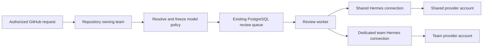

# Team access and model accounts

Team membership, repository ownership and requests, scoped console reports and
actions, owner/admin roles, and the audit journal are implemented in the source
candidate. See [Admin panel](ADMIN_PANEL.md) for the current operator contract.
Model connections, team model choices, justified JSON audit access, Codex quota
visibility, and fair scheduling with concurrency caps are also implemented in the
source candidate. Scoped application credentials and the versioned reporting API
are also implemented. Track implementation and rollout on the existing
`ra-teams-and-integrations-wtd` epic.

## Smallest useful product model

Use **Teams** as the only user-group concept. A user can belong to several teams;
each repository has one owning team for account routing and reporting. A team
can own five repositories or fifty without needing a separate deployment.
GitHub App grants and Review Agent repository activation remain independent
prerequisites. Team membership does not grant GitHub access or bypass requester
authorization.

This is basic role-based access control (RBAC): one fixed action-to-role mapping
in the application, combined with the resource's team ownership. Reuse FastAPI
authentication dependencies and the existing user model. Do not introduce a
policy engine, custom-role editor, nested groups, or a second identity service.

| Role | Scope and capabilities |
| --- | --- |
| Platform owner | All teams, privileged accounts, shared connections, deployment settings, sensitive audit events, and operational controls. |
| Platform admin | All teams, member accounts, repository ownership and approval, ordinary audit events, and review operations. Cannot change owner/admin accounts or global credentials/settings. |
| Team maintainer | Request repository onboarding; manage membership of their team among existing active users; choose allowed models; reconnect a team-owned account; triage feedback and retry or cancel their team's reviews. Connection assignment requires a platform administrator. Cannot grant platform privileges or move repositories between teams. |
| Team viewer | Read their team's reviews, quality reports, and operational usage. Cannot change access, accounts, model policy, or review state. |

Team maintainers can reconnect a team-owned account. Shared-account login,
replacement, and disconnection remain platform-owner operations because
they affect other teams. Display the affected teams before a shared change.
Keep the existing global viewer role during migration; explicitly label it as
deployment-wide access. Convert users to scoped membership deliberately rather
than silently changing who can read retained reviews.

Every server query and object action must enforce scope, including totals,
search suggestions, exports, finding history, feedback, direct review links,
and login-session polling. Filtering the frontend alone is insufficient.
Unassigned repositories stay visible to platform administrators and retain the
shared execution route; they do not become visible to every team. Historical
review access follows the repository's current owner, while historical usage
attribution retains the team recorded when the request was admitted.

Membership removal takes effect on the next server operation, rather than
waiting for a browser refresh or a long-lived role claim to expire. Clear cached
team data when a user signs out or loses access. A maintainer adds an existing
user by exact identity without receiving a directory of every platform user.
Membership writes cannot change global roles or move a repository's owner.

Keep the console's HTTPS session cookies, same-origin mutation protection,
restricted content security policy, and safe Markdown rendering. Reject raw
provider URLs and arbitrary control commands from team forms. Connection
endpoints are administrator-managed internal service identities with independent
control credentials, fixed allowed operations, no redirects, bounded responses,
and timeouts. Preserve secret-free audit records and protected credential-volume
backups; restoration must not accidentally clone one account into multiple
independently refreshing runtimes.

## GitHub App and repository onboarding

Use one organization-owned GitHub App for the production platform, installed in
`sundsvallskommun` with access to selected repositories. The platform operator owns
its private key, webhook configuration, permissions, rotation, and upgrades. Teams
do not create or maintain separate Apps. Additional organizations can install the
same App where its distribution allows; development and staging should use
separate App identities and credentials. Independent production Apps only earn
their operating cost when there is a separate trust or infrastructure boundary.

GitHub controls which repositories the App can access. Review Agent controls
which granted repositories are enabled and which team owns them. A platform
administrator is not necessarily a GitHub organization owner. Show a link to the
existing installation settings when a GitHub grant is missing; the authorized
GitHub administrator performs that change there. Keep production GitHub calls on
installation tokens. Do not add a PAT or an organization-wide user credential to
make the App grant itself access. GitHub's organization policy determines whether
repository administrators can install an App or must request an owner to do so;
see [GitHub installation controls](https://docs.github.com/en/organizations/managing-programmatic-access-to-your-organization/limiting-oauth-app-and-github-app-access-requests-and-installations).

The normal team workflow has one Review Agent approval:

1. A maintainer selects their team and enters a repository URL or `owner/name`.
   The server validates the GitHub host and name without fetching arbitrary URLs.
   It creates a pending request visible to that team and platform administrators.
2. A platform administrator sees the request in the console's pending requests
   list and badge, verifies the intended ownership, and resolves any missing
   GitHub grant. Reuse existing installation inventory and reconciliation to
   verify access and obtain the stable GitHub repository ID.
3. Once the grant is verified, one **Approve and enable** action assigns the
   owning team, applies the approved default profile and model policy, and enables
   reviews. Commit ownership, activation, and the request decision in one database
   transaction after rechecking access. A rejected request includes a reason;
   the requesting team sees the result.

Store the request and its decision durably, with requester, team, repository
identity, timestamps, and decision actor/reason. Keep a small request lifecycle:
pending, approved, rejected, or withdrawn. Derive “Waiting for GitHub access”
from the current grant instead of creating another independently editable state.
Treat repeat submissions and approval retries idempotently. Resolve name changes
to the verified repository ID before approving, and serialize ownership changes
so concurrent requests cannot assign one repository to two teams. Do not reveal
another team's ownership or private repository metadata through request errors.
Start with the in-app pending badge and request status; email or chat delivery
can follow a demonstrated need without becoming the source of approval state.

The existing installation activation policy supports automatic and explicit
activation. Use explicit activation for the proposed approval-managed workflow;
otherwise GitHub access alone can activate reviews before the team decision.
Changing an existing automatic installation to explicit currently disables its
automatically enabled repositories. Migration must enumerate and deliberately
preserve approved repositories with explicit activation in the same controlled
change. Do not silently apply that switch to the running deployment.

Removing a GitHub grant or suspending the installation stops admission and
publication through the existing authorization checks. Show the affected team's
repository as unavailable and retain its permitted history. A repository rename
keeps ownership through its stable ID; transfer to another organization or team
requires a new ownership/access check and an audited administrator action.
Pausing reviews retains the GitHub grant and history. Offboarding a team pauses
or reassigns its repositories, resolves queued work, revokes memberships and
dedicated connections, and preserves retained audit/usage data. It does not
delete repositories or other teams' access from the shared App installation.

## Team and platform views

Use one console with a team selector. A user belonging to one team lands directly
in that team's workspace and sees no selector; a multi-team user can switch
between their teams. The
same Activity, Reviews, and Review quality pages use the selected team's scope.
The team overview shows its repositories, recent review outcomes, queue health,
model connection and available quota, and feedback requiring attention. Team
maintainers also see members, model choices, and repository requests. Keep
deployment infrastructure and global credentials in platform administration.

Platform administrators start with the deployment overview and a Teams list.
Selecting a team opens that same team view, including its repositories, members,
statistics, and configuration. Keep the selected team and administrator identity
visible; this is scoped navigation, not impersonation. Team and date filters
should survive navigation and direct links. Server checks decide which scopes a
user can select; a URL parameter never grants access.

Shared-account quota is account-wide. Label it as shared and show the team's own
recorded Review Agent usage separately. Do not expose another team's reviews or
account identity through a shared connection's reporting. Show retained usage
from before a repository transfer only as permitted aggregate attribution to the
former team; access to the transferred repository's review content follows its
current owner. This avoids using historical usage as a route around revocation.

## Application API and future MCP access

The console and the versioned integration API use the same application operations,
metric definitions, and scoped repository/run relations. Authorization is resolved
inside the transaction containing the report, before aggregation and pagination.
A separate typed integration principal has no user-management or control role.
There is no duplicate reporting SQL, consumer database access, or caller-supplied
administrator flag.

Platform administrators create an expiring credential with immutable grants for
selected teams or explicit deployment-wide access. Review outcome metadata and
aggregate statistics are available by default; published review content requires
an additional grant. Only the credential digest is stored. Expiry and revocation
are checked on each operation, and reads are recorded in the existing audit
journal without secrets or review bodies. See
[Application integrations](ADMIN_PANEL.md#application-integrations) for creation,
rotation, revocation, error responses and an HTTP example.

The `/api/v1/` contract exposes repository activity, review outcomes, token usage,
and recorded quality evidence with generated OpenAPI schemas. It includes stable
IDs, UTC intervals, a metric version, generation time, and the existing telemetry
and truncation indicators. Page sizes are bounded. Repository and review pages
use ID cursors and a watermark that excludes newer IDs, while explicitly
preserving live-state semantics. Consumers retain their interval and filters,
reread overlapping intervals, and deduplicate IDs to account for late commits,
retention and ownership transfers. The watermark is not a retained snapshot.

MCP remains an optional thin adapter over these same operations and schemas.
Repository text and findings remain untrusted content and cannot authorize further
tool actions. Larger asynchronous exports or materialized reporting need measured
consumer demand; a stored export would require an owner, retention and an access
check at download. Revocation stops subsequent access, although it cannot retract
previously downloaded data or interrupt a read already in progress.

## Connections and model policy

A **model connection** identifies a managed Hermes runtime and its private
credential storage. It can be shared or owned by one team. Teams inherit the
deployment's shared connection unless an administrator assigns a dedicated one.
Initially allow one account per provider within each connection. This makes
account identity, quota, reconnect, and reporting unambiguous.

For example, Platform and Web can share the existing connection, while Payments
uses a dedicated Codex account. Adding another team does not create another
runtime unless it needs independent credentials. A connection can hold an
authorized account for each supported provider; the team selects its route
explicitly. Automatic fallback is not part of this implementation.

Provider, model, and reasoning effort inherit deployment defaults. A team may
override them within the administrator's allowed choices. Show both the effective
value and where it came from. Avoid repository overrides until a concrete need
justifies another policy layer. Review behavior profiles continue to own review
instructions; account routing does not create copies of those profiles.

Review Agent owns team permission checks, account assignment, scheduling, and
audit history. Hermes owns authentication, credential refresh, provider calls,
and provider-specific recovery. The browser receives status and login challenges,
never OAuth access or refresh tokens.

## What Hermes provides

The deployed image pins Hermes `v2026.8.31`. Its provider runtime supports OAuth
credential pools and same-provider rotation. Those pools choose credentials by
provider strategy, not by Review Agent team. Pool selection counters are not
billing totals. A single pool containing every team's accounts would therefore
not establish team usage isolation. See the upstream
[credential pool documentation](https://hermes-agent.nousresearch.com/docs/user-guide/features/credential-pools).

Hermes also supports HTTP profile routing, but a profile can inherit provider
credentials from the global home when local credentials are absent. Profile
names alone are therefore insufficient isolation. Prefer separate container
processes and data volumes for independently owned connections, with no shared
global auth store or ambient provider credentials. Reuse the same application
image and reviewed profile. This adds one runtime per independently managed
connection, rather than one complete Review Agent stack per team.

Apply the connection boundary to fallback, compression, other auxiliary model
calls, and any permitted subagents. A dedicated connection must not discover a
shared or another team's account on failure. The managed configuration disables
implicit cross-provider fallback. Hermes's [fallback documentation](https://hermes-agent.nousresearch.com/docs/user-guide/features/fallback-providers)
describes separate main and auxiliary paths; both need verification against the
pinned image. Cross-connection fallback is deferred.

This isolates credential usage. It is not a claim of hostile-tenant isolation:
the existing deployment shares PostgreSQL and application services. Stronger
infrastructure tenancy would be a separate requirement.

## OAuth and quota visibility

The console initiates Codex login through the selected connection's provider
control service. It shows the provider URL, short-lived code, expiry, cancel action,
and progress. The session is bound to the initiating user, team, connection, and
configuration revision. Each operation rechecks permission; login and replacement
are serialized per connection and stale results are rejected.
Hermes persists and refreshes the credential in that connection's own volume.
Drain active work before replacing an account; queued work must not silently
switch to a different account identity.

Hermes's pinned
[`agent/account_usage.py`](https://github.com/NousResearch/hermes-agent/blob/29112bef099274229cadff79cdff7bf7b99c4b77/agent/account_usage.py)
reads Codex account windows and reset-credit availability. The source candidate
adds a native Hermes quota endpoint and allows it through the existing HTTP-only
provider-control companion. Credentials stay in Hermes. Its usage reader has a
source-checked patch that preserves window duration, bucket identity and labels,
percentage units, reset timestamps, and structured reset-credit counts. It binds
the request to the observed account and rejects an identity change during refresh.
Provider reads have a 15-second timeout, a 256 KiB response limit, and at most
32 buckets with two windows each. Missing fields remain unknown. Image tests
exercise the patched helper with synthetic HTTP responses, including small
percentages, missing fields, and multiple buckets.

OpenAI documents `account/rateLimits/read`, including window duration, used
percentage, reset time, multiple limit buckets, and optional reset credits.
This confirms that provider-backed quota telemetry exists; it does not mean
the Hermes integration uses that app-server transport. See
[Codex App Server](https://learn.chatgpt.com/docs/app-server).

Claude Code documents five-hour and seven-day usage fields in its status line,
available only in particular account modes and after an API response. That is
not a general-purpose Hermes administration API. More materially, Anthropic's
current authentication guidance restricts third-party Claude.ai login and routing
through consumer-plan credentials, while Hermes documents an OAuth path with
different entitlement assumptions. Keep that conflict explicit. Do not promise
shared Claude subscription access or build our own Claude login flow; use an
authorized provider integration for that deployment. Sources:
[Claude status line](https://code.claude.com/docs/en/statusline),
[Anthropic authentication restrictions](https://code.claude.com/docs/en/legal-and-compliance),
[Hermes provider guidance](https://hermes-agent.nousresearch.com/docs/integrations/providers).

Each connection shows the reported plan, remaining percentage, actual window
duration, reset time, last successful refresh, and provider bucket metadata.
Unavailable values are explicit, and failed refreshes retain the last successful
snapshot with a stale label. A passed reset time makes the snapshot stale; it does
not prove quota recovered. Anthropic API-key quota is unavailable through this
integration. The console does not expose Hermes's consumer OAuth usage path.

Hermes caches snapshots per provider account and coalesces concurrent reads.
Pages and execution preflight refresh after five minutes; manual refresh is
limited to once per 30 seconds. Failed reads back off from 30 seconds to five
minutes. A known exhausted account can be checked sooner at a reported reset,
with the same minimum interval. Account changes discard the previous snapshot.
Provider quota includes other uses of that account; it is displayed separately
from team review activity.

Available reset credits can be shown when reported. Consuming one is a separate,
explicitly confirmed owner action with idempotency and an audit event; it is not
an automatic retry or the same action as refreshing quota. Defer redemption
controls from the first quota release.

## Useful statistics and operating behavior

Extend existing Activity and Review quality reports with team and connection
filters. Start with published and failed requests, queue age, median and p95
completion time, recorded tokens and telemetry completeness, quota-related
waiting, and feedback awaiting triage. Keep model and reasoning cohorts so a
policy change can be compared using its actual request population. Feedback
counts retain their denominators; they are not an accuracy score. Avoid per-user
productivity rankings and monetary estimates derived from subscription tokens.

The PostgreSQL claim owner enforces team and connection concurrency caps across
worker replicas. Both default to four. The owner controls shared connection
capacity; platform admins can edit team-owned connections. Platform administrators
control team capacity across connections.
Eligible teams take turns, with priority aging within each team. A short claim
transaction serializes the occupancy check and lease reservation. Provider calls
and heartbeats do not hold that lock. Existing repository exclusion also applies
while an unfinished remote execution exists. The production-scale benchmark
exercises 100, 1,000 and 10,000 queued reviews across 10, 100 and 1,000 teams.

Before native inference, an explicit Codex account denial records one account
wait deadline and returns the unstarted review to its queue without spending an
attempt. All queued reviews on that account share the wait, which appears in
scoped history and Operations. Passing the deadline permits a fresh check; only
a fresh provider allowance clears known exhaustion. A refresh failure preserves
the wait. Unknown initial quota uses ordinary execution error handling. Additional
model-specific buckets are displayed without guessing their model routing.

Leased jobs and unfinished remote executions both occupy capacity. A timeout,
lease expiry, cancellation, or terminal local failure cannot prove that inference
stopped. The native handler's completion releases its reservation; interrupted
runtime recovery requires the existing explicit restart and reconciliation flow.
Quota observations cannot reserve provider capacity against other applications.
Exact subscription-token budgets are unavailable from incomplete usage responses.
Usage alerts and local review-start allowances remain future work if operators
need them; they are not implied by these concurrency controls.

## Existing owners and implementation boundaries

| Concern | Extend this owner |
| --- | --- |
| Teams and membership | Existing admin authentication model and PostgreSQL migrations; keep global role separate from team membership role. |
| Repository requests and ownership | Existing repository registry and GitHub App inventory, access, and activation operations; add a small durable request record and stable-ID team assignment. |
| Connection assignment and model policy | Existing audited settings revision pattern; add team scope, without copying all deployment settings per team. |
| Frozen route | Existing admission and immutable review contract: store team, connection, account identity/revision, provider, model, reasoning, and permitted fallback. Store IDs, never credentials or user-controlled URLs. |
| Execution and capacity | Existing review worker, PostgreSQL jobs, leases, and recovery. Resolve trusted connection endpoints server-side from the frozen assignment. |
| OAuth, health, quota | Existing `hermes_control`, provider gateway, and admin provider API; fixed operations for the selected connection. |
| Reporting and future integrations | Existing application operations, usage records, and reporting queries; shared scope enforcement and metric contracts for console/API/MCP. Add admission-time attribution and actual provider/model where Hermes supplies it. Missing actual-route telemetry stays unknown. |

Connection disablement stops new dispatch immediately, even for a queued frozen
route. A settings change affects new admissions; account replacement requires
an explicit disposition for existing queued work. Never silently reroute it.
Changes to membership, ownership, connection assignment, policy, and account
lifecycle record actor, time, reason, and revision, without secrets.

Implement in independently useful increments on the canonical board: team
membership, repository onboarding, and complete authorization first; frozen shared/dedicated
connections second; quota display and fair scheduling after the provider
projection is proven. Keep the existing deployment as the shared default. Do
not copy OAuth stores, introduce a database per team, add nested groups/custom
role builders, build a new inference proxy, or provision arbitrary containers
from a team-facing form. Generic OIDC sign-in and basic SCIM provisioning are
approved as a separate identity slice on the same epic. Keep existing-account
linking explicit, identify OIDC users by issuer and subject, and preserve local
role/owner safeguards during provisioning.

Acceptance must include cross-team direct-link and aggregate denial, multi-team
membership, duplicate and concurrent onboarding approvals, missing/revoked GitHub
grants, migration from automatic activation, repository transfer and retained
usage visibility, integration identity revocation, bounded export pagination,
old queued routes after policy changes, disabled
connections, quota exhaustion without cross-team fallback, concurrent claims and
lease recovery, missing/stale quota, OAuth expiry/cancellation, and preservation
of the existing shared-account deployment. Validate these behaviors at their
existing interfaces rather than creating a new test framework.
