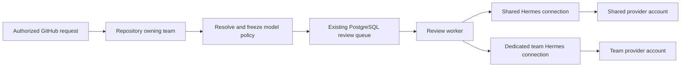

# Team access and model accounts

This is a design proposal, not a shipped feature. It supports one shared model
account today and independently managed team accounts later, without a Nous
Portal dependency. Implementation and rollout remain separate work on the
existing board. Design issue: `ra-quality-2026-09-614.4.11`.

## Smallest useful product model

Use **Teams** as the only user-group concept. A user can belong to several teams;
each repository has one owning team for account routing and reporting. A team
can own five repositories or fifty without needing a separate deployment.
GitHub App grants and Review Agent repository activation remain independent
prerequisites. Team membership does not grant GitHub access or bypass requester
authorization.

This is basic role-based access control (RBAC): one fixed action-to-role mapping
in the application, combined with the resource's team ownership. Reuse FastAPI
authentication dependencies and the existing user model. Do not introduce a
policy engine, custom-role editor, nested groups, or a second identity service.

| Role | Scope and capabilities |
| --- | --- |
| Platform administrator | Manage teams, users, repository ownership, shared connections, deployment settings, and all operational controls. |
| Team maintainer | Request repository onboarding; manage membership of their team among existing active users; choose allowed models and connections; triage feedback and retry or cancel their team's reviews. Cannot grant platform privileges or move repositories between teams. |
| Team viewer | Read their team's reviews, quality reports, and operational usage. Cannot change access, accounts, model policy, or review state. |

Team maintainers can reconnect a team-owned account. Shared-account login,
replacement, and disconnection remain platform-administrator operations because
they affect other teams. Display the affected teams before a shared change.
Keep the existing global viewer role during migration; explicitly label it as
deployment-wide access. Convert users to scoped membership deliberately rather
than silently changing who can read retained reviews.

Every server query and object action must enforce scope, including totals,
search suggestions, exports, finding history, feedback, direct review links,
and login-session polling. Filtering the frontend alone is insufficient.
Unassigned repositories stay visible to platform administrators and retain the
shared execution route; they do not become visible to every team. Historical
review access follows the repository's current owner, while historical usage
attribution retains the team recorded when the request was admitted.

Membership removal takes effect on the next server operation, rather than
waiting for a browser refresh or a long-lived role claim to expire. Clear cached
team data when a user signs out or loses access. A maintainer adds an existing
user by exact identity without receiving a directory of every platform user.
Membership writes cannot change global roles or move a repository's owner.

Keep the console's HTTPS session cookies, same-origin mutation protection,
restricted content security policy, and safe Markdown rendering. Reject raw
provider URLs and arbitrary control commands from team forms. Connection
endpoints are administrator-managed internal service identities with independent
control credentials, fixed allowed operations, no redirects, bounded responses,
and timeouts. Preserve secret-free audit records and protected credential-volume
backups; restoration must not accidentally clone one account into multiple
independently refreshing runtimes.

## GitHub App and repository onboarding

Use one organization-owned GitHub App for the production platform, installed in
`sundsvallskommun` with access to selected repositories. The platform operator owns
its private key, webhook configuration, permissions, rotation, and upgrades. Teams
do not create or maintain separate Apps. Additional organizations can install the
same App where its distribution allows; development and staging should use
separate App identities and credentials. Independent production Apps only earn
their operating cost when there is a separate trust or infrastructure boundary.

GitHub controls which repositories the App can access. Review Agent controls
which granted repositories are enabled and which team owns them. A platform
administrator is not necessarily a GitHub organization owner. Show a link to the
existing installation settings when a GitHub grant is missing; the authorized
GitHub administrator performs that change there. Keep production GitHub calls on
installation tokens. Do not add a PAT or an organization-wide user credential to
make the App grant itself access. GitHub's organization policy determines whether
repository administrators can install an App or must request an owner to do so;
see [GitHub installation controls](https://docs.github.com/en/organizations/managing-programmatic-access-to-your-organization/limiting-oauth-app-and-github-app-access-requests-and-installations).

The normal team workflow has one Review Agent approval:

1. A maintainer selects their team and enters a repository URL or `owner/name`.
   The server validates the GitHub host and name without fetching arbitrary URLs.
   It creates a pending request visible to that team and platform administrators.
2. A platform administrator sees the request in the console's pending requests
   list and badge, verifies the intended ownership, and resolves any missing
   GitHub grant. Reuse existing installation inventory and reconciliation to
   verify access and obtain the stable GitHub repository ID.
3. Once the grant is verified, one **Approve and enable** action assigns the
   owning team, applies the approved default profile and model policy, and enables
   reviews. Commit ownership, activation, and the request decision in one database
   transaction after rechecking access. A rejected request includes a reason;
   the requesting team sees the result.

Store the request and its decision durably, with requester, team, repository
identity, timestamps, and decision actor/reason. Keep a small request lifecycle:
pending, approved, rejected, or withdrawn. Derive “Waiting for GitHub access”
from the current grant instead of creating another independently editable state.
Treat repeat submissions and approval retries idempotently. Resolve name changes
to the verified repository ID before approving, and serialize ownership changes
so concurrent requests cannot assign one repository to two teams. Do not reveal
another team's ownership or private repository metadata through request errors.
Start with the in-app pending badge and request status; email or chat delivery
can follow a demonstrated need without becoming the source of approval state.

The existing installation activation policy supports automatic and explicit
activation. Use explicit activation for the proposed approval-managed workflow;
otherwise GitHub access alone can activate reviews before the team decision.
Changing an existing automatic installation to explicit currently disables its
automatically enabled repositories. Migration must enumerate and deliberately
preserve approved repositories with explicit activation in the same controlled
change. Do not silently apply that switch to the running deployment.

Removing a GitHub grant or suspending the installation stops admission and
publication through the existing authorization checks. Show the affected team's
repository as unavailable and retain its permitted history. A repository rename
keeps ownership through its stable ID; transfer to another organization or team
requires a new ownership/access check and an audited administrator action.
Pausing reviews retains the GitHub grant and history. Offboarding a team pauses
or reassigns its repositories, resolves queued work, revokes memberships and
dedicated connections, and preserves retained audit/usage data. It does not
delete repositories or other teams' access from the shared App installation.

## Team and platform views

Use one console with a team selector. A user belonging to one team lands directly
in that team's overview; a multi-team user can switch between their teams. The
same Activity, Reviews, and Review quality pages use the selected team's scope.
The team overview shows its repositories, recent review outcomes, queue health,
model connection and available quota, and feedback requiring attention. Team
maintainers also see members, model choices, and repository requests. Keep
deployment infrastructure and global credentials in platform administration.

Platform administrators start with the deployment overview and a Teams list.
Selecting a team opens that same team view, including its repositories, members,
statistics, and configuration. Keep the selected team and administrator identity
visible; this is scoped navigation, not impersonation. Team and date filters
should survive navigation and direct links. Server checks decide which scopes a
user can select; a URL parameter never grants access.

Shared-account quota is account-wide. Label it as shared and show the team's own
recorded Review Agent usage separately. Do not expose another team's reviews or
account identity through a shared connection's reporting. Show retained usage
from before a repository transfer only as permitted aggregate attribution to the
former team; access to the transferred repository's review content follows its
current owner. This avoids using historical usage as a route around revocation.

## Future API and MCP access

Build team scoping into the existing application/reporting owners now. The
console, later integration API, and MCP tools must call the same authorized
application operations and metric definitions. Each receives an authenticated
principal and a validated scope; database queries apply that scope before
aggregation and pagination. Do not accept a caller-supplied administrator flag,
duplicate reporting SQL in MCP handlers, or give consumers direct database
access. Team membership also protects counts, facets, cached results, and export
rows, rather than only protecting individual review pages.

When the first organizational consumer is ready, expose a small versioned,
read-only HTTP contract for repositories, review outcomes, and usage/quality
statistics. Generate its OpenAPI types from validated response models. Include
stable IDs, explicit UTC intervals, metric definitions/version, generation time,
and telemetry completeness. Use bounded page sizes, stable ordering and cursor
pagination for growing histories; define snapshot/watermark behavior so repeated
pages do not silently skip or duplicate records. Keep UTC interval semantics and
feedback denominators identical to the console.

Give each consuming application its own revocable integration identity with
explicit team scope or administrator-approved deployment-wide read scope. Report
read access does not confer user management, provider login, or deployment
control. Default to aggregate statistics; grant review content separately when a
consumer needs it. Reuse a suitable existing organizational machine-identity
issuer if available; choose the credential mechanism when integrating that first
consumer, without building an identity provider now. Record access and apply
bounded query/export limits without logging secrets or review bodies.

MCP can then be a thin adapter over those same read operations and schemas,
preserving the caller's identity and scope. Repository text and findings remain
untrusted content and cannot authorize further tool actions. Keep large exports
paged initially. Add asynchronous exports or materialized reporting only after
measured volume requires them; any stored export must have an owner, retention
limit, and authorization recheck at download. Revocation stops subsequent access,
although it cannot retract data that a consumer already downloaded.

## Connections and model policy

A **model connection** identifies a managed Hermes runtime and its private
credential storage. It can be shared or owned by one team. Teams inherit the
deployment's shared connection unless an administrator assigns a dedicated one.
Initially allow one account per provider within each connection. This makes
account identity, quota, reconnect, and reporting unambiguous.

For example, Platform and Web can share the existing connection, while Payments
uses a dedicated Codex account. Adding another team does not create another
runtime unless it needs independent credentials. A team may configure an
approved second provider in its own connection as an explicit fallback.

Provider, model, and reasoning effort inherit deployment defaults. A team may
override them within the administrator's allowed choices. Show both the effective
value and where it came from. Avoid repository overrides until a concrete need
justifies another policy layer. Review behavior profiles continue to own review
instructions; account routing does not create copies of those profiles.

Review Agent owns team permission checks, account assignment, scheduling, and
audit history. Hermes owns authentication, credential refresh, provider calls,
and provider-specific recovery. The browser receives status and login challenges,
never OAuth access or refresh tokens.

## What Hermes provides

The deployed image pins Hermes `v2026.8.31`. Its provider runtime supports OAuth
credential pools and same-provider rotation. Those pools choose credentials by
provider strategy, not by Review Agent team. Pool selection counters are not
billing totals. A single pool containing every team's accounts would therefore
not establish team usage isolation. See the upstream
[credential pool documentation](https://hermes-agent.nousresearch.com/docs/user-guide/features/credential-pools).

Hermes also supports HTTP profile routing, but a profile can inherit provider
credentials from the global home when local credentials are absent. Profile
names alone are therefore insufficient isolation. Prefer separate container
processes and data volumes for independently owned connections, with no shared
global auth store or ambient provider credentials. Reuse the same application
image and reviewed profile. This adds one runtime per independently managed
connection, rather than one complete Review Agent stack per team.

Apply the connection boundary to fallback, compression, other auxiliary model
calls, and any permitted subagents. A dedicated connection must not discover a
shared or another team's account on failure. Disable implicit cross-provider
fallback by default and expose only an explicit, bounded policy within the
connection. Hermes's [fallback documentation](https://hermes-agent.nousresearch.com/docs/user-guide/features/fallback-providers)
describes separate main and auxiliary paths; both need verification against the
pinned image. Cross-connection fallback is deferred.

This isolates credential usage. It is not a claim of hostile-tenant isolation:
the existing deployment shares PostgreSQL and application services. Stronger
infrastructure tenancy would be a separate requirement.

## OAuth and quota visibility

The console should initiate a login through the selected connection's provider
control service. For supported device login, show the provider URL, short-lived
code, expiry, cancel action, and progress. Bind the session to the initiating
user, team, connection, and configuration revision. Recheck permission on each
operation; serialize login/replacement for a connection and reject stale results.
Hermes persists and refreshes the credential in that connection's own volume.
Drain active work before replacing an account; queued work must not silently
switch to a different account identity.

Hermes's pinned
[`agent/account_usage.py`](https://github.com/NousResearch/hermes-agent/blob/29112bef099274229cadff79cdff7bf7b99c4b77/agent/account_usage.py)
already reads Codex account windows and reset-credit availability and has a
Claude OAuth usage reader. Interactive `/usage` uses this helper. Its HTTP review
API does not expose those readers as quota endpoints. Add a small Hermes-side
read endpoint, preferably upstream, then allow that exact operation through our
existing provider-control companion. The companion keeps its current HTTP-only
boundary and does not gain access to credential files. Hermes returns a typed,
redacted projection for that connection, with bounded provider responses and
timeouts; it remains the only authentication owner.

This requires a pinned integration change, not just serializing the existing
helper. Its result drops window durations, puts reset-credit counts into prose,
and labels primary/secondary windows as Session/Weekly. Its Claude path resolves
ambient credentials instead of accepting the supplied account token, and guesses
whether small utilization values are fractions or percentages. Preserve provider
units, bucket identity, structured credit counts, and account binding explicitly
before exposing these fields. Test sub-one-percent usage, missing windows, and
multiple accounts. Do not parse display prose or guess units in the console.

OpenAI documents `account/rateLimits/read`, including window duration, used
percentage, reset time, multiple limit buckets, and optional reset credits.
This confirms that provider-backed quota telemetry exists; it does not mean
our Hermes HTTP integration already offers that contract. See
[Codex App Server](https://learn.chatgpt.com/docs/app-server).

Claude Code documents five-hour and seven-day usage fields in its status line,
available only in particular account modes and after an API response. That is
not a general-purpose Hermes administration API. More materially, Anthropic's
current authentication guidance restricts third-party Claude.ai login and routing
through consumer-plan credentials, while Hermes documents an OAuth path with
different entitlement assumptions. Keep that conflict explicit. Do not promise
shared Claude subscription access or build our own Claude login flow; use an
authorized provider integration for that deployment. Sources:
[Claude status line](https://code.claude.com/docs/en/statusline),
[Anthropic authentication restrictions](https://code.claude.com/docs/en/legal-and-compliance),
[Hermes provider guidance](https://hermes-agent.nousresearch.com/docs/integrations/providers).

Each quota row should show a friendly account label, provider, connection owner,
reported plan where available, **remaining** percentage, window duration, reset
time, last successful refresh, and a clear connection state. Use returned window
durations and provider bucket labels; do not hard-code two windows for all plans.
Display missing data as unavailable and stale data with its timestamp. A missing
reset is unknown, not proof that no reset is pending. A passed reset time makes
the snapshot stale until refreshed; it does not prove quota recovered.

Cache quota snapshots per provider account, with a bounded polling interval and
backoff. Coalesce manual refreshes so ten team pages cannot send ten identical
provider calls. Start with five-minute background refresh while the connection
is in use and a rate-limited manual refresh. Recheck the actual upstream limits
when implementing. Provider quota includes other uses of that account; never
attribute its entire change to Review Agent.

Available reset credits can be shown when reported. Consuming one is a separate,
explicitly confirmed owner action with idempotency and an audit event; it is not
an automatic retry or the same action as refreshing quota. Defer redemption
controls from the first quota release.

## Useful statistics and operating behavior

Extend existing Activity and Review quality reports with team and connection
filters. Start with published and failed requests, queue age, median and p95
completion time, recorded tokens and telemetry completeness, quota-related
waiting, and feedback awaiting triage. Keep model and reasoning cohorts so a
policy change can be compared using its actual request population. Feedback
counts retain their denominators; they are not an accuracy score. Avoid per-user
productivity rankings and monetary estimates derived from subscription tokens.

Fair scheduling matters even when teams share one account. Extend the existing
PostgreSQL claim transaction to reserve a connection slot and a team slot
atomically across worker replicas. Select among eligible teams before claiming
the next job, preserving priority aging within each team. A team without capacity
must not occupy worker slots while another eligible team waits. Keep bounded
queries and validate the claim plan with representative queue sizes.

A provider quota failure should record a retry time and a visible waiting reason,
not burn the entire ordinary retry budget during a multi-day cooldown. Reuse the
durable availability deadline and fencing; release reservations on completion,
failure, cancellation, or lease expiry. A timeout can leave remote inference
running, so database lease expiry alone is not proof that a provider slot is free:
capacity recovery must reconcile or conservatively drain that attempt. Quota
snapshots guide scheduling but cannot guarantee remaining capacity when other
applications use the same account.

Start with team concurrency limits, fair scheduling, and usage alerts. A local
review-start allowance can be enforced atomically if operators need a hard
application limit. Exact subscription-token budgets are not available from
incomplete usage responses; do not label a soft estimate as a hard quota.

## Existing owners and implementation boundaries

| Concern | Extend this owner |
| --- | --- |
| Teams and membership | Existing admin authentication model and PostgreSQL migrations; keep global role separate from team membership role. |
| Repository requests and ownership | Existing repository registry and GitHub App inventory, access, and activation operations; add a small durable request record and stable-ID team assignment. |
| Connection assignment and model policy | Existing audited settings revision pattern; add team scope, without copying all deployment settings per team. |
| Frozen route | Existing admission and immutable review contract: store team, connection, account identity/revision, provider, model, reasoning, and permitted fallback. Store IDs, never credentials or user-controlled URLs. |
| Execution and capacity | Existing review worker, PostgreSQL jobs, leases, and recovery. Resolve trusted connection endpoints server-side from the frozen assignment. |
| OAuth, health, quota | Existing `hermes_control`, provider gateway, and admin provider API; fixed operations for the selected connection. |
| Reporting and future integrations | Existing application operations, usage records, and reporting queries; shared scope enforcement and metric contracts for console/API/MCP. Add admission-time attribution and actual provider/model where Hermes supplies it. Missing actual-route telemetry stays unknown. |

Connection disablement stops new dispatch immediately, even for a queued frozen
route. A settings change affects new admissions; account replacement requires
an explicit disposition for existing queued work. Never silently reroute it.
Changes to membership, ownership, connection assignment, policy, and account
lifecycle record actor, time, reason, and revision, without secrets.

Implement in independently useful increments on the canonical board: team
membership, repository onboarding, and complete authorization first; frozen shared/dedicated
connections second; quota display and fair scheduling after the provider
projection is proven. Keep the existing deployment as the shared default. Do
not copy OAuth stores, introduce a database per team, add nested groups/custom
role builders, build a new inference proxy, or provision arbitrary containers
from a team-facing form. SSO and automated provisioning can follow demonstrated
onboarding demand.

Acceptance must include cross-team direct-link and aggregate denial, multi-team
membership, duplicate and concurrent onboarding approvals, missing/revoked GitHub
grants, migration from automatic activation, repository transfer and retained
usage visibility, integration identity revocation, bounded export pagination,
old queued routes after policy changes, disabled
connections, quota exhaustion without cross-team fallback, concurrent claims and
lease recovery, missing/stale quota, OAuth expiry/cancellation, and preservation
of the existing shared-account deployment. Validate these behaviors at their
existing interfaces rather than creating a new test framework.
